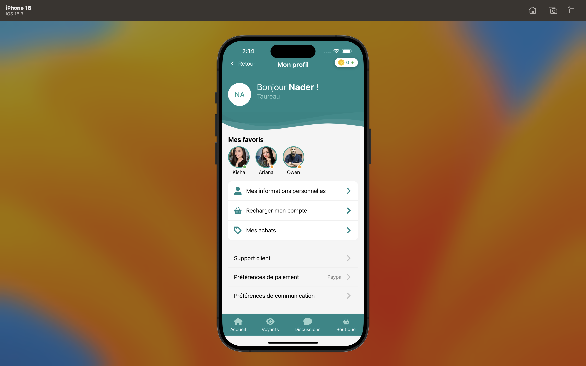
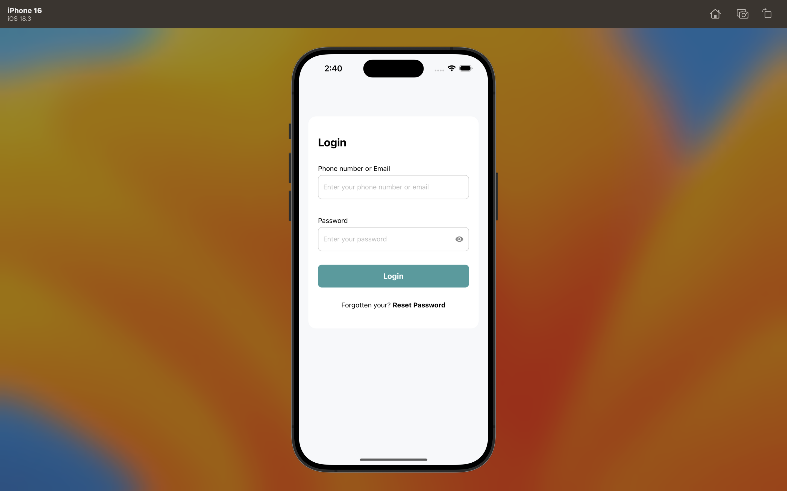

# MWE Psychic Profile App

This mobile app was built as part of a technical test. It includes a functional **login screen** and a **profile screen**, both connected to the MWE API.

- **Login Screen**: Authenticates the user using the `/login` endpoint and stores the token using Context API.
- **Profile Screen**: Displays user data (avatar, name, zodiac, cash balance, favorite psychics) fetched from `/mwe-user/accounts` and `/mwe-psychic/psychics`.

Authentication is handled using **Context API** for secure state management across the app.

## 📸 Screenshots

Here are some screenshots of the Cat Tinder app:

### 🐾 Profile Screen

### 🐾 Login Screen

